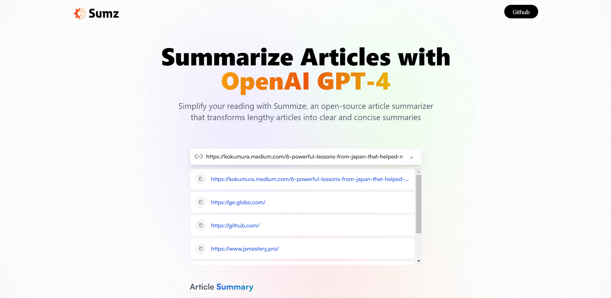

<h1 style="color: #FFA500; font-weight: bold">Summize</h1>

Summarize Articles with OpenAI GPT-4

Simplify your reading with Summize, an open-source article summarizer that transforms lengthy articles into clear and concise summaries




 <h2 style="color: #6a1b9a; font-weight: bold">🚀 Getting Started</h2>

To get started with Summize, follow the steps below:

Prerequisites

Node.js installed on your local machine

npm or yarn package manager installed on your local machine

<h2 style="color: #6a1b9a; font-weight: bold">Installation</h2>

Clone the repository to your local machine using git clone https://github.com/aguiarHugo/Summize.git
Navigate to the project directory using cd Summize.
Installing Dependencies
Summize requires a few dependencies to be installed. You can install them using npm or yarn package manager. Run the following command to install the dependencies:

```
npm install
```
or
```
yarn install
```

The following dependencies will be installed:

<h2 style="color: #6a1b9a; font-weight: bold">Dependencies</h2>
<span style="color: #6a1b9a">@reduxjs/toolkit</span>: "^1.9.5"

<span style="color: #6a1b9a">react</span>: "^18.2.0"

<span style="color: #6a1b9a">react-dom</span>: "^18.2.0"

<span style="color: #6a1b9a">react-redux</span>: "^8.0.5"

<h2 style="color: #6a1b9a; font-weight: bold">Dev Dependencies</h2>
<span style="color: #6a1b9a">@types/react</span>: "^18.0.28"

<span style="color: #6a1b9a">@types/react-dom</span>: "^18.0.11"

<span style="color: #6a1b9a">@vitejs/plugin-react</span>: "^4.0.0-beta.0"

<span style="color: #6a1b9a">autoprefixer</span>: "^10.4.14"

<span style="color: #6a1b9a">eslint</span>: "^8.38.0"

<span style="color: #6a1b9a">eslint-plugin-react</span>: "^7.32.2"

<span style="color: #6a1b9a">eslint-plugin-react-hooks</span>: "^4.6.0"

<span style="color: #6a1b9a">eslint-plugin-react-refresh</span>: "^0.3.4"

<span style="color: #6a1b9a">postcss</span>: "^8.4.23"

<span style="color: #6a1b9a">tailwindcss</span>: "^3.3.1"

<span style="color: #6a1b9a">vite</span>: "^4.3.0"

<h2 style="color: #6a1b9a; font-weight:bold">🌐 Starting the Development Server</h2>

After installing the dependencies, you can start the development server using the following command:

```
npm run dev
```
or
```
yarn dev
```

This will start the development server and open the application in your default web browser.

<h2 style="color: #6a1b9a; font-weight:bold">🏗️ Building the Project</h2>
To build the project for production, you can use the following command:

```
npm run build
```

or

```
yarn build
```

This will generate a production-ready build of the application